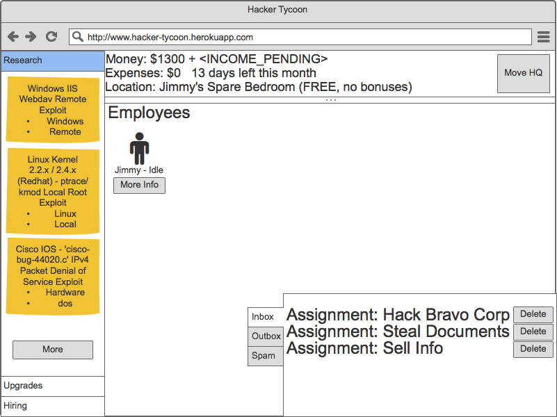
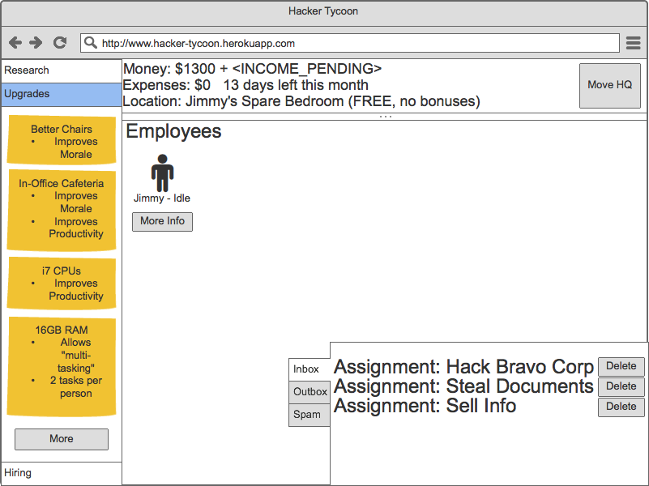
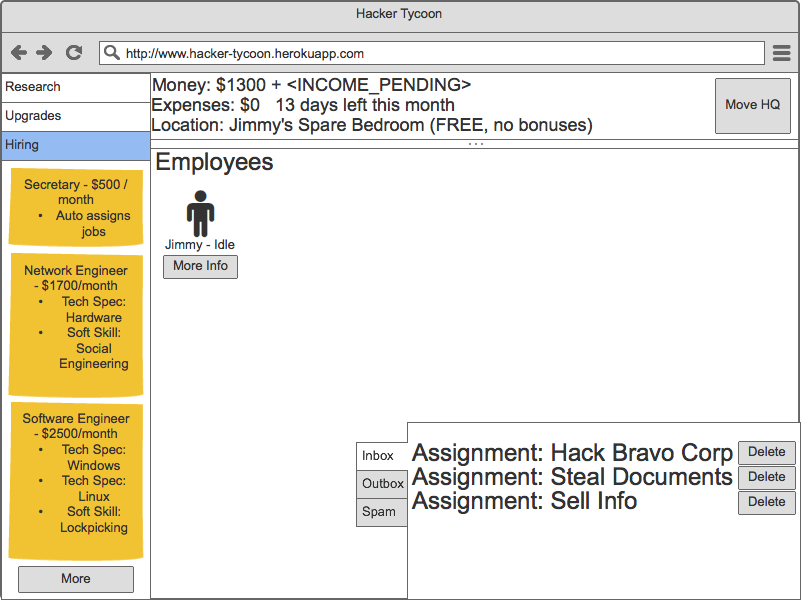
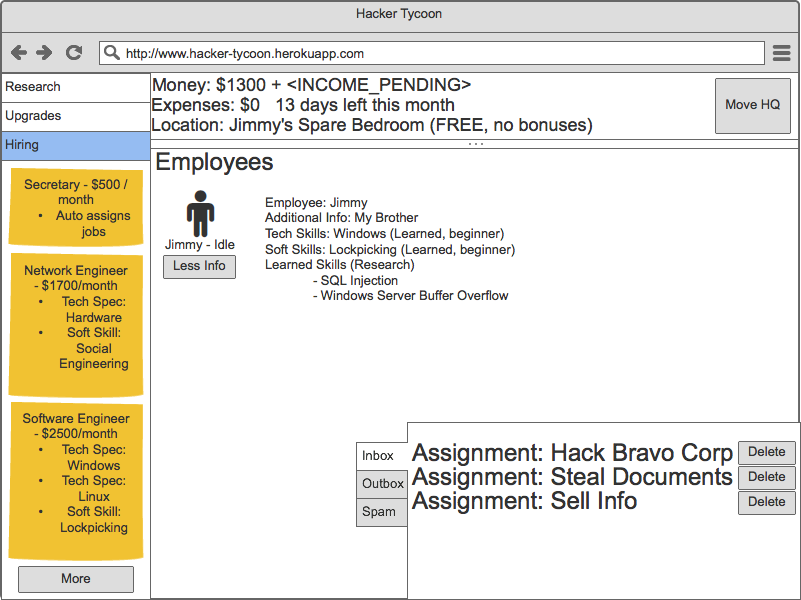
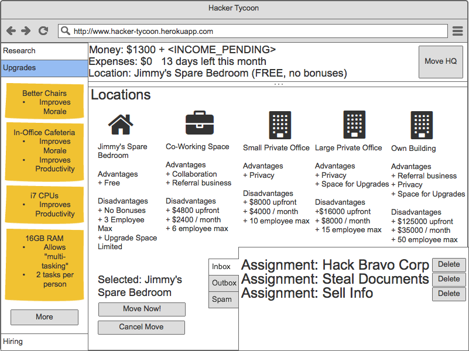
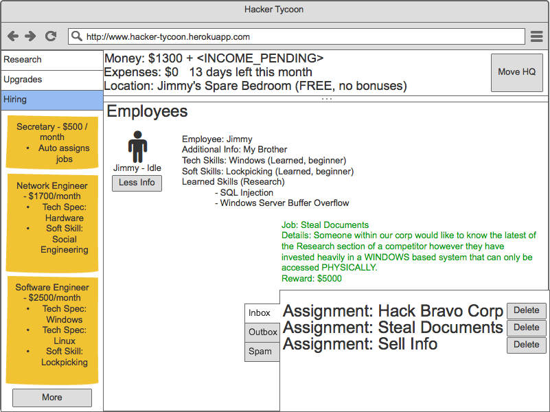
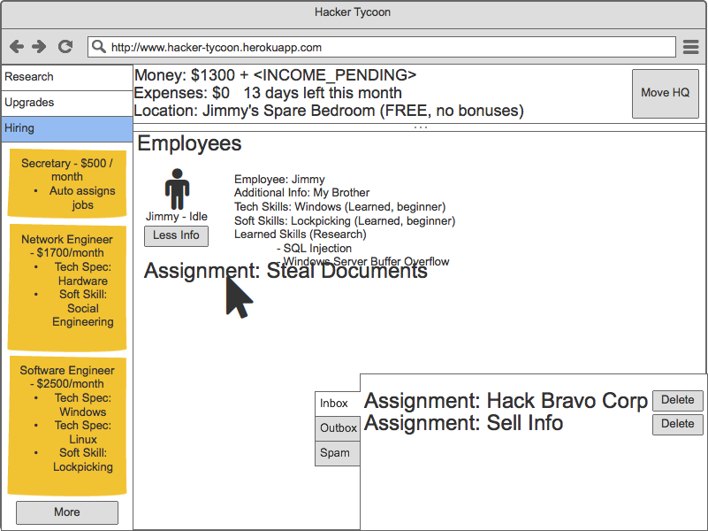
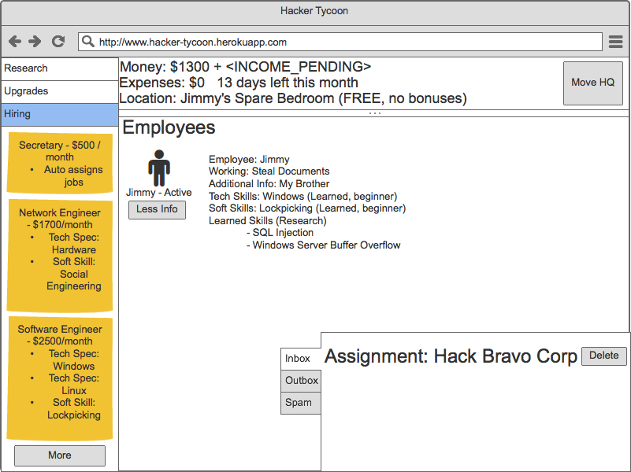
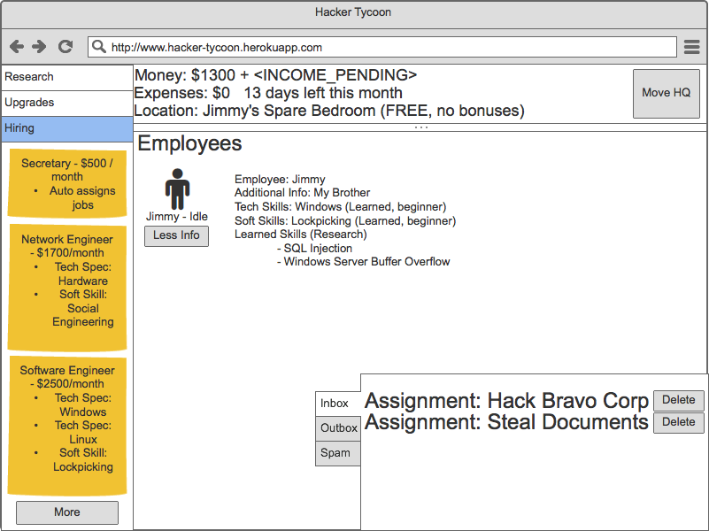

# hacker-tycoon

Why be the hacker when you can be the guy calling the shots? Play through an increasingly harder game where you manage everything from exploits to develop, upgrades to buy, personnel to hire and where to operate your business.

Take on increasingly legal (or illegal) contracts to make more and more money. Only your reputation can keep you afloat in this hacking simulation.

# Research

 

Drag any exploit to an employee, and train your people to use it. Those who research the most can tackle the hardest assignments. Remember, you may not be the only talent in town and failing too many assignments may hurt you in the future.

Will you make very well trained individuals or very broadly trained employees?

# Upgrades

 

Who said this was any other office? Upgrade your hardware and your overall business to ensure your employees and happier and more productive. Noone ever said 'I hate this job' while having a free beer in the open bar provided by your company.

# Hiring

 

Tired of assigning items to your employees and want to focus on broader world conquering ventures? Tired of failing assignments because your employees keep failing Linux assignments? Hire yourself a secretary to be able to focus on other matters and a new set of Linux engineers to keep your reputation from tanking.

Will you hire green people and train or hire more mature employees to bolster your company's skillset?

Go in depth and improve your employees' soft and tech skills. Need to break into a building? Better choose someone with decent lockpicking ability. Need to bypass security cameras? Someone with electrical knowledge and hardware experience may be able to get you through most obstacles. The more assignments and the more research performed, the better your employees will perform in the field.

# HQ

Location, location, location. The golden rule of professionalism, very few people will hire you while working out of your brother's spare bedroom, but get a decent office and money will continue flowing in. The more space, the more you can expand your employee count and your upgrades.

# Jobs

Money is the root of all problems... and all solutions. Picking up new jobs opens new oportunities. Pick your employee (or employees) well in order to knock it out of the park. Employees will get experience and your company will be known for getting things done.

Don't forget, turning down a job is always an option but taking a job and failing it will reflect worse on you.

# Additional Data

Use the exploit-database files from Offensive Security -> https://github.com/offensive-security/exploit-database/blob/master/files.csv for Research goals.

Use the company database files from OpenData 500 -> http://www.opendata500.com/us/list/ for targets.

Start game from Jimmy's Spare Bedroom and build up your empire from there.